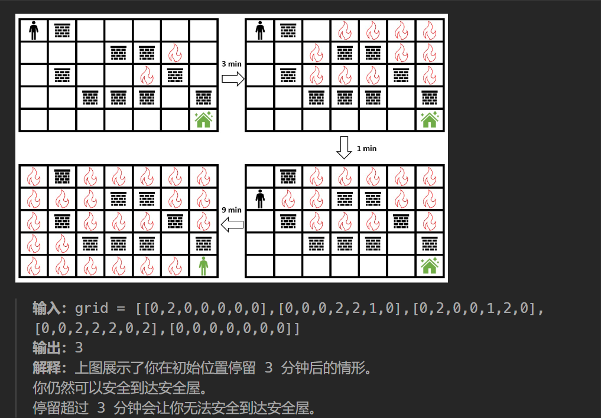

[2258. 逃离火灾 - 力扣（LeetCode）](https://leetcode.cn/problems/escape-the-spreading-fire/description/?envType=daily-question&envId=2023-11-09)

参考题解：https://leetcode.cn/problems/escape-the-spreading-fire/solutions/1460794/er-fen-bfspythonjavacgo-by-endlesscheng-ypp1/?envType=daily-question&envId=2023-11-09

# 题目要求



# 思路分析

#### 思路1（bfs + 二分）

- 二分停留时间 t
- 先bfs_fire  t次，表示火已经扩散了t分钟
- 之后bfs_people，同时bfs_fire
- 期间判断人能否走到终点(m - 1,n - 1)【返回true or false】
- 不过，二分的边界判断就比较多了，有无法到达【$-1$】，有无论怎样都可以到达【$1000000000$】，需要设置多重判断！

#### 思路2（直接计算，更快！）

- 分别利用bfs计算火与 人到达每一个格子的最短时间【用time数组记录】
- 原理：人t1到达C，火t2到达C，如果人比火先到C,那么t1 < t2，且不会出现中途火把人烧了的情况；
- 反证：如果，中途火把人烧了，那么火一定能按照人来时的最短路径到C，也就是说火与人到达C的时间就相同了，这很明显不符，t1 < t2！
- 设人在 t1分钟到达安全屋，火在 t2分钟到达安全屋，那么人可以在初始位置停留 t2−t1吗？
-  题目允许人和火可以同时到达安全屋，但却不允许同时到达除安全屋以外的其他地方。
- 假设人和火在t时刻同时到达安全屋(m - 1,n - 1)，那么是不是有这样一种可能？人与火在t - 1时刻到达(m - 2,n - 1)或(m - 1,n - 2)；这种情况是不符的，我们应当删除，进行一下特判即可！


$本文中均采用用两个数组实现bfs，这是因为这样可以记录每次bfs后的数组，如果用队列的话，bfs完了，队列也就空了，我们还需要再次初始化，这样就比较麻烦！$


# 代码撰写

#### 思路1：

```python
class Solution:
    def maximumMinutes(self, grid: List[List[int]]) -> int:
        m,n = len(grid),len(grid[0])
        
        def check(t):
            # 火势传播，每一次传播主要更新 vis_fire
            fire = []
            for i in range(m):
                for j in range(n):
                    if grid[i][j] == 1:
                        fire.append((i,j))
            vis_fire = set(fire)
            def spread_fire():
                nonlocal fire
                tmp = fire
                fire = []
                for i,j in tmp:
                    for x,y in (i - 1, j), (i + 1, j), (i, j - 1), (i, j + 1):
                        if 0 <= x < m and 0 <= y < n and grid[x][y] == 0 and (x, y) not in vis_fire:
                            vis_fire.add((x, y))
                            fire.append((x, y))

            # 等待t分钟！
            while t and fire:
                spread_fire()
                t -= 1
            if (0,0) in vis_fire:
                return False
            
            # 人走，火也走！
            people = [(0,0)]
            vis_people = set(people)
            while people:
                tmp = people
                people = []
                for i,j in tmp:
                    if (i,j) in vis_fire:continue
                    for x,y in (i - 1, j), (i + 1, j), (i, j - 1), (i, j + 1):
                        if 0 <= x < m and 0 <= y < n and grid[x][y] == 0 and (x, y) not in vis_fire and (x, y) not in vis_people:
                            if x == m - 1 and y == n - 1:
                                return True
                            vis_people.add((x,y))
                            people.append((x,y))
                spread_fire()
            return False

        # print([check(i) for i in range(1,10)])
        
        # 二分模板：求最右边的值！
        left,right = 0,m * n
        while left < right:
            # 注意 left = mid的时候，mid = left + right + 1 >> 1
            mid = left + right + 1 >> 1
            if check(mid):
                left = mid
            else:
                right = mid - 1

        if left == m * n:
            return 10 ** 9
        #  这个二分有点歹毒，有两个边界情况，有点意思！
        elif left == 0 and not check(0):
            return -1
        else:
            return left
```

#### 思路2【快好多！】

```python
class Solution:
    def maximumMinutes(self, grid: List[List[int]]) -> int:
        m,n = len(grid),len(grid[0])
        
        def bfs(q):
            time = [[-1] * n for _ in range(m)]
            for i,j in q:
                time[i][j] = 0
            t = 1
            while q:
                tmp = q
                q = []
                for i,j in tmp:
                    for x, y in (i - 1, j), (i + 1, j), (i, j - 1), (i, j + 1):
                        if 0 <= x < m and 0 <= y < n and grid[x][y] == 0 and time[x][y] < 0:
                            time[x][y] = t
                            q.append((x, y))
                t += 1
            return time[-1][-1],time[-1][-2],time[-2][-1]

        t_people,t_left_people,t_top_people = bfs([(0,0)])
        if t_people < 0:
            return -1
        
        fire = [(i,j) for i in range(m) for j in range(n) if grid[i][j] == 1]
        t_fire,t_left_fire,t_top_fire = bfs(fire)
        if t_fire < 0:
            return 10 ** 9
        
        d = t_fire - t_people
        if d < 0:
            return -1
        
        if t_left_people != -1 and t_left_people + d < t_left_fire or t_top_people != -1 and t_top_people + d < t_top_fire:
            return d
        return d - 1
```
