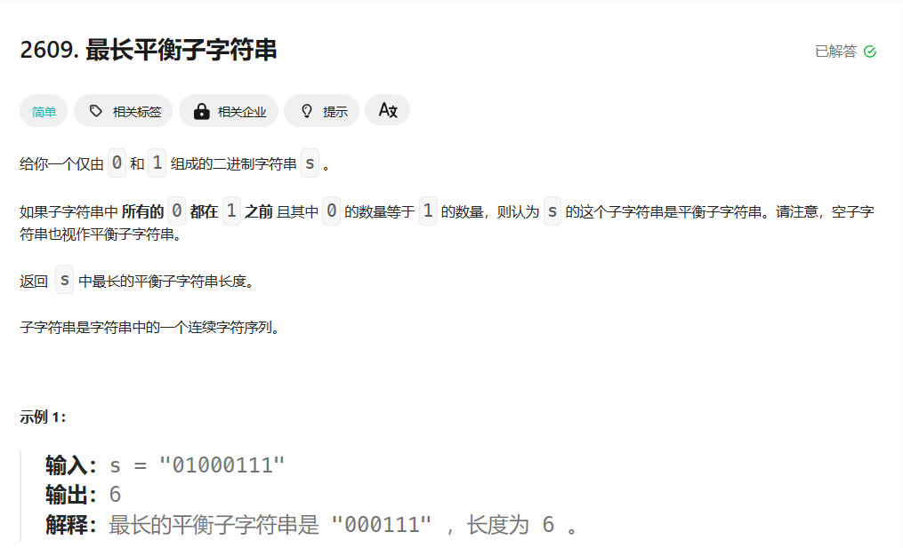

[2609. 最长平衡子字符串 - 力扣（LeetCode）](https://leetcode.cn/problems/find-the-longest-balanced-substring-of-a-binary-string/description/)

# 题目要求




# 代码撰写

```python
class Solution:
    def findTheLongestBalancedSubstring(self, s: str) -> int:
        n,i,ans = len(s),0,0
        while i < n:
            zero,one = 0,0
            while i < n and s[i] == '0':
                zero,i = zero + 1,i + 1
            while i < n and s[i] == '1':
                one,i = one + 1,i + 1
            ans = max(ans,min(zero,one) * 2)
        return ans
```

