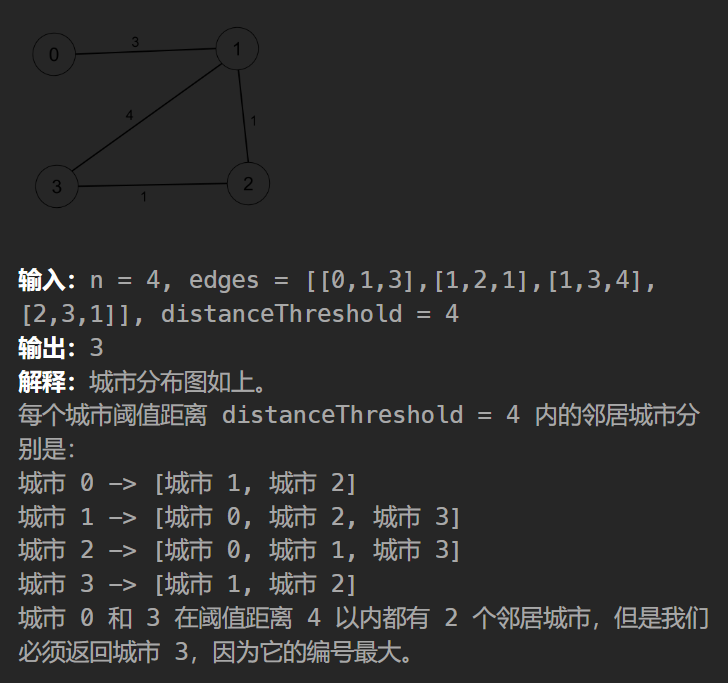

[1334. 阈值距离内邻居最少的城市](https://leetcode.cn/problems/find-the-city-with-the-smallest-number-of-neighbors-at-a-threshold-distance/description/?envType=daily-question&envId=2023-11-14)

## 题目描述

有 `n` 个城市，按从 `0` 到 `n-1` 编号。给你一个边数组 `edges`，其中 `edges[i] = [fromi, toi, weighti]` 代表 `fromi` 和 `toi` 两个城市之间的双向加权边，距离阈值是一个整数 `distanceThreshold`。

返回能通过某些路径到达其他城市数目最少、且路径距离 **最大** 为 `distanceThreshold` 的城市。如果有多个这样的城市，则返回编号最大的城市。

$注意，连接城市i和j的路径的距离等于沿该路径的所有边的权重之和。$ $2 <= n <= 100$




## 思路分析

- 题目要求的其实就是每一个点到其他点的最短路径长度，选取其中小于阈值的点的个数
- 数据范围只有100，直接$Floyd  O(n^3)$速通！
- 当然也可以对每一个点用Dijkstra，求单源最短路！


## 代码撰写

```python
from math import inf
class Solution:
    def findTheCity(self, n: int, edges: List[List[int]], d: int) -> int:
        g = [[inf] * n for _ in range(n)]
        for u,v,w in edges:
            g[u][v] = g[v][u] = w
        for k in range(n):
            g[k][k] = 0
            for i in range(n):
                for j in range(n):
                    g[i][j] = min(g[i][j],g[i][k] + g[k][j])
        ans,idx= inf,0
        for i in range(n):
            cnt = sum(g[i][j] <= d for j in range(n))
            if cnt <= ans:
                ans,idx = cnt,i
        return idx
```

```python
# Dijkstra(非堆优化版本 O(n^2))
def Dijkstra(x):
    d = [inf] * n
    vis = [False] * n
    d[x] = 0
    for i in range(n):
        t = -1
        for j in range(n):
            if not vis[i][j] and (t == -1 or dis[j] < dis[t]):
                t = j
        vis[t] = True
        for k in range(n):
            dis[k] = min(dis[k],dis[t] + g[t][k])
```

## Floyd的算法思想

参考链接：[1334. 阈值距离内邻居最少的城市 - 力扣（LeetCode）](https://leetcode.cn/problems/find-the-city-with-the-smallest-number-of-neighbors-at-a-threshold-distance/solutions/2525946/dai-ni-fa-ming-floyd-suan-fa-cong-ji-yi-m8s51/?envType=daily-question&envId=2023-11-14)（灵神太神了）

本质是图的一种动态规划算法

- $定义dfs(k,i,j)表示从i到j的最短路长度并且最短路的中间节点编号都小于等于k$
- $不选k，dfs(k,i,j) = dfs(k - 1,i,j)$
- $选k,  dfs(k,i,j) = dfs(k - 1,i,k) + dfs(k - 1,k,j)$
- $递归边界：dfs(-1,i,j) = w[i][j]$


