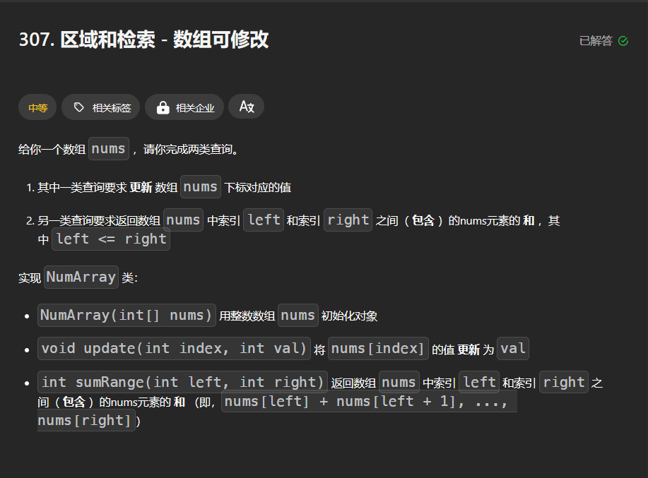

[307. 区域和检索 - 数组可修改 - 力扣（LeetCode）](https://leetcode.cn/problems/range-sum-query-mutable/?envType=daily-question&envId=2023-11-13)


## 题目大意



## 思路分析

没啥好分析的，单点修改，区间查询，树状数组启动！

有一点需要注意，根据树状数组的性质，tree的下标要从1开始;

同时每次修改也要改变原数组的值，因为每次更行都会用到原数组来判断更新值的大小val - nums[i]

## 代码撰写

```python
class NumArray:
    def __init__(self, nums: List[int]):
        self.nums = nums
        self.tree = [0] * (len(nums) + 1)
        self.n = len(nums)
        # O(nlogn)的初始化
        for i,x in enumerate(nums,1):
            self.update1(i,x)
        # O(n)的初始化
        '''
        for i, x in enumerate(nums, 1):
                tree[i] += x
                nxt = i + (i & -i)
                if nxt <= n:
                    tree[nxt] += tree[i]
         '''
    def update(self, idx: int, val: int) -> None:
        self.update1(idx + 1,val - self.nums[idx])
        self.nums[idx] = val
    def sumRange(self, left: int, right: int) -> int:
        return self.query(right + 1) - self.query(left)

    
    # 默写树状数组模板！
    def lowbit(self,x):
        return x & -x
    def update1(self,i,x):
        while i <= self.n:
            self.tree[i] += x
            i += self.lowbit(i)
    def query(self,x):
        s = 0
        while x > 0:
            s += self.tree[x]
            x -= self.lowbit(x) # x &= x - 1 
        return s
```

## 树状数组的理解图


