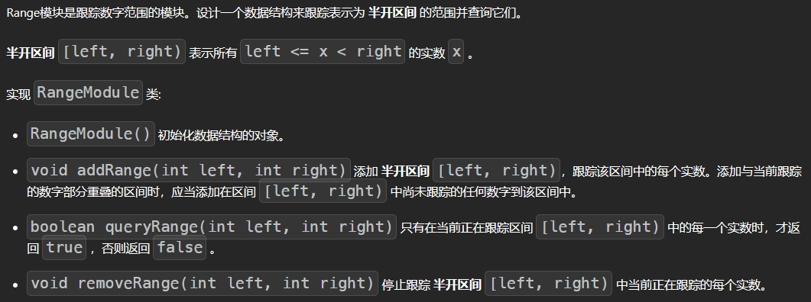

# [715. Range 模块 - 力扣（LeetCode）](https://leetcode.cn/problems/range-module/)





## 代码撰写

```python
MAX_RANGE = int(1e9 + 7)
class RangeModule:

    def __init__(self):
        self.st = SegmentTree()

    def addRange(self, left: int, right: int) -> None:
        SegmentTree.update(self.st.root, 1, MAX_RANGE, left, right - 1, True)

    def queryRange(self, left: int, right: int) -> bool:
        return SegmentTree.query(self.st.root, 1, MAX_RANGE, left, right - 1)

    def removeRange(self, left: int, right: int) -> None:
        SegmentTree.update(self.st.root, 1, MAX_RANGE, left, right - 1, False)

class Node:
    def __init__(self) -> None:
        self.ls = self.rs = None
        self.val = self.add = False

class SegmentTree:
    def __init__(self):
        self.root = Node()
    
    @staticmethod
    def update(node: Node, lc: int, rc: int, l: int, r: int, v: bool) -> None:
        if l <= lc and rc <= r:
            node.val = v
            # 注意产生变化懒标记就为True，因为更新有删除
            node.add = True
            return
        SegmentTree.pushdown(node)
        mid = (lc + rc) >> 1
        if l <= mid:
            SegmentTree.update(node.ls, lc, mid, l, r, v)
        if r > mid:
            SegmentTree.update(node.rs, mid + 1, rc, l, r, v)
        SegmentTree.pushup(node)
 
    @staticmethod
    def query(node: Node, lc: int, rc: int, l: int, r: int) -> bool:
        if l <= lc and rc <= r:
            return node.val
        # 先确保所有关联的懒标记下沉下去
        SegmentTree.pushdown(node)
        mid, ans = (lc + rc) >> 1, True
        if l <= mid:
            ans = ans and SegmentTree.query(node.ls, lc, mid, l, r)
        if r > mid:
            # 同样为不同题目中的更新方式
            ans = ans and SegmentTree.query(node.rs, mid + 1, rc, l, r)
        return ans
    
    @staticmethod
    def pushdown(node: Node) -> None:
        # 懒标记, 在需要的时候才开拓节点和赋值
        if node.ls is None:
            node.ls = Node()
        if node.rs is None:
            node.rs = Node()
        if not node.add:
            return
        node.ls.val, node.rs.val = node.val, node.val
        # 注意产生变化懒标记就为True，因为更新有删除
        node.ls.add, node.rs.add = True, True
        node.add = False
    
    @staticmethod
    def pushup(node: Node) -> None:
        # 动态更新方式：此处为两者都true
        node.val = node.ls.val and node.rs.val
```

